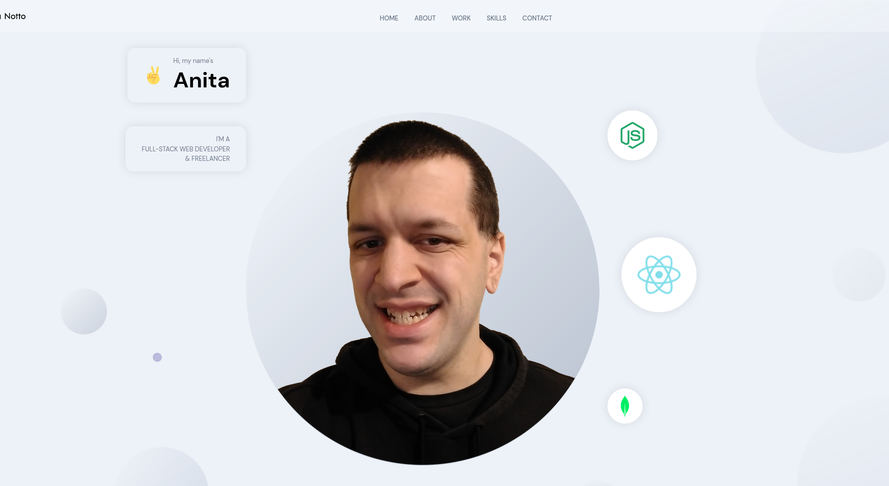

# AnitaNotto.com
Portfolio site showcasing my projects and how to contact me, using React.js and Sanity.io

**Link to project:** https://anitanotto.com

## How It's Made:

**Tech used:** React, SASS, Sanity.io

I wanted to have a modern, responsive page to showcase my skills that was easy to update with any new projects I made, so I implemented the Sanity.io CMS for that functionality and to allow handling of my contact form.

## Optimizations
If I had more time to improve this project I would use the GitHub API to automate the updating of my projects on the page.

## Lessons Learned:
How easy having a CMS makes it to update a page with new content.

How to write cleaner CSS media queries using SASS.

## Examples:
Live site availabile at https://anitanotto.com
